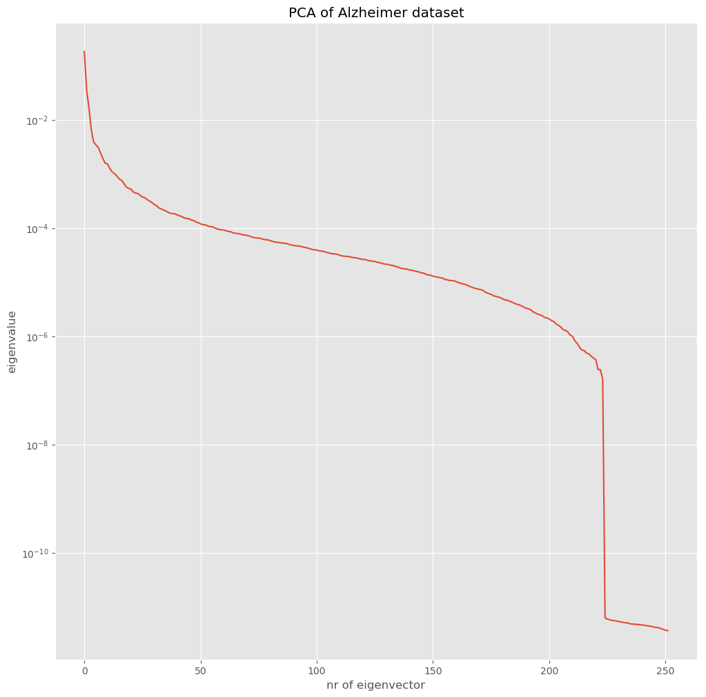

# Chapter

## Figure by reference

{width=70% #fig:62eigenspectrum}

In figure @fig:62eigenspectrum we can see the plot of the eigenspectrum.

## Example of footnotes

His ut eirmod fabellas vituperatoribus. An libris ridens volutpat has, per omnium deterruisset ex. Utamur veritus sea id. Dico viris ex quo, per possim virtute iuvaret cu, eos corpora ancillae reformidans ea. Cum instructior consectetuer conclusionemque ea, pri at tollit labitur. Cum aliquam oportere mnesarchum at, aliquid delenit has ne, salutatus persequeris in ius [^one].

[^one]: And here's the footnote.

## Citations

Cite this paper [@sklearn], or that paper [@lfd], or this one [@taxicab].

Bibliography should be coming up. Check out [bib.bib](bib.bib)
